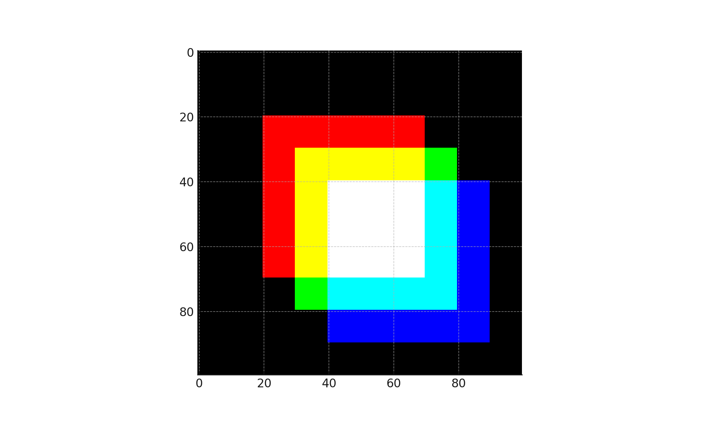

# Understanding Colour Images with Python 🌈🐍🖼️

This repository contains a Jupyter notebook that explores how colour images are represented in Python using the Numpy and Matplotlib libraries. This can be an excellent starting point for anyone interested in image processing, computer vision, or just curious about how digital images work!



## What Will You Learn? 🧠💡

1. **Numpy**: Learn how to use Numpy to create and manipulate arrays, the building blocks of images in Python.
2. **Matplotlib**: Get to know how to use Matplotlib to display and interact with images.
3. **Images in Python**: Understand how images are represented in Python as multidimensional arrays and how manipulating these arrays can change the image.
4. **Colour Channels**: Dive deep into the RGB colour model and see how changing each channel can create colourful effects!

## Getting Started 🚀

### Prerequisites

- Python 3.10
- Jupyter
- Numpy
- Matplotlib

### Installation

1. Clone the repo
```
https://github.com/olaola-0/understanding-colour-images.git
```
2. Install Jupyter
```
pip install notebook
```
3. Install Numpy
```
pip install numpy
```
4. Install Matplotlib
```
pip install matplotlib
```
7. Open the notebook `understanding_colour_images.ipynb` and start learning!

##
